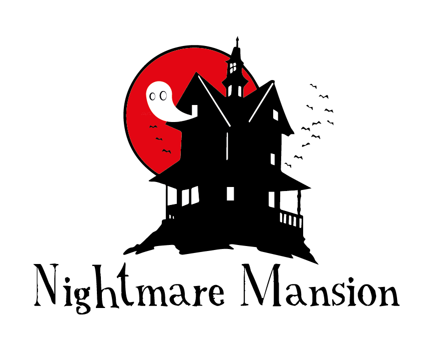

# Nightmare Mansion

## Introduction

> Projet de **2eme année de Master MTI3D**.  

Projet fait par Justine Bertrand, Mathilde Beuvin, Nicolas Frenot, Baptiste Manusset, Maxence Rouillet

## Utilisation / Installation

> Ce projet nécessite : 
- Unity 2017.1.1 
- un casque Vr compatible avec Steam Vr ou un casque MRTK
- un bras haptique Falcon Novint.

Avant de lancer le projet il est nécessaire de lancer le serveur du Falcon (FalconServer.exe).